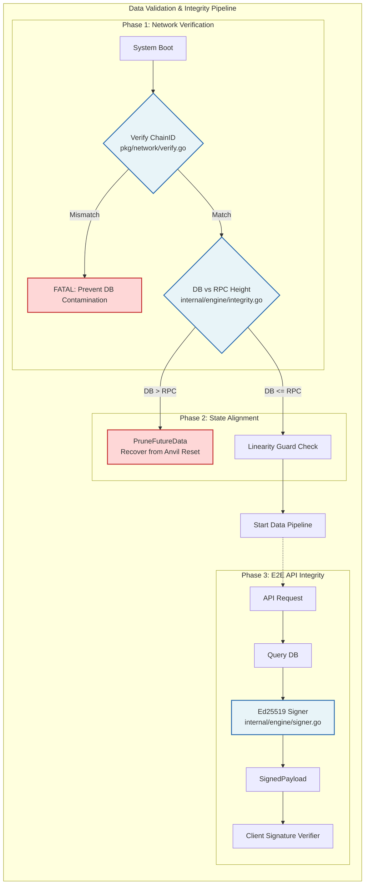

# Industrial-Grade Web3 Indexer

[🌐 **English**](./README.md) | [🏮 **中文说明**](./README_ZH.md) | [🗾 **日本語の説明**](./README_JA.md)

### 🚀 Live Demos
*   **Production (Sepolia)**: [https://demo1.st6160.click/](https://demo1.st6160.click/)
*   **Local Lab (Anvil)**: [https://demo2.st6160.click/](https://demo2.st6160.click/)
*   **Engineering Journey**: [Read the 10-Day Sprint Log](./DEVELOPMENT.md) 🚀

An ultra-reliable, cost-efficient Ethereum event indexer built with **Go**, **PostgreSQL**, and **Docker**. Designed for teams that need production-grade blockchain data pipelines without the infrastructure overhead.

## 💼 Business Value

*   **Reduce RPC Costs by 70%+**: Integrated **Weighted Token Bucket** rate-limiter maximizes free-tier quotas from Alchemy/Infura (primary/backup weighted 3:1). Production tested at 3.5 RPS sustained without hitting rate limits.
*   **Eliminate Downtime**: **Staging-to-Production** workflow enables zero-downtime deployments with < 2s switchover. Critical for revenue-impacting systems.
*   **Auto-Recovery from Rate Limits**: **429 Circuit Breaker** detects provider throttling, triggers 5-minute cooldown, and auto-fails over to backup RPC nodes. No manual intervention required.
*   **Prevent Costly Data Corruption**: Mandatory **NetworkID/ChainID verification** at startup guarantees no cross-environment database contamination—saves hours of debugging and potential financial errors.
*   **Real-Time UX Without Waste**: **Range-Based Ingestion** with 50-block batching and Keep-alive progress mechanism keeps dashboards responsive even during low-activity periods.
*   **No Cold-Start Penalties**: **Early-Bird API** decouples web server from engine initialization—ports open in milliseconds, eliminating load balancer 502 errors during deployments.

## 🛠️ Tech Stack

*   **Backend**: Go (Golang) + `go-ethereum`
*   **Infrastructure**: Docker (Multi-environment isolation)
*   **Storage**: PostgreSQL (Per-instance isolated databases)
*   **Observability**: Prometheus + Grafana (Environment-switchable dashboards)

## 📦 Production Deployment

Staging-to-Production workflow ensures stable releases:

1.  **Test**: Deploy to Staging via `make test-a1` or `make test-a2`.
2.  **Verify**: Smoke test on staging endpoints.
3.  **Promote**: Hot-swap to Production via `make a1` or `make a2`.
    *   *Mechanism*: `docker tag :latest -> :stable` + `docker compose up -d --no-build`

## 📈 Performance & Optimization

| Mode | Target Network | RPS Limit | Latency | Cost Strategy |
| :--- | :--- | :--- | :--- | :--- |
| **Stable** | Sepolia (Testnet) | 3.5 RPS | ~12s | Weighted Multi-RPC (free-tier optimized) |
| **Demo** | Anvil (Local) | 10000+ RPS | < 1s | Zero-Throttling (development) |
| **Debug** | Sepolia (Testnet) | 5.0 RPS | ~12s | Direct Commercial RPC (troubleshooting) |

## 🔐 Security & Data Integrity

*   **Chain Verification**: Enforced at startup to prevent environment misconfiguration
*   **API Response Signing**: All responses signed with **Ed25519** for end-to-end integrity verification
*   **Physical Isolation**: Docker-based environment separation prevents data leakage

### Data Validation & Integrity Pipeline

---

*MIT License — Production-ready for commercial deployments*
