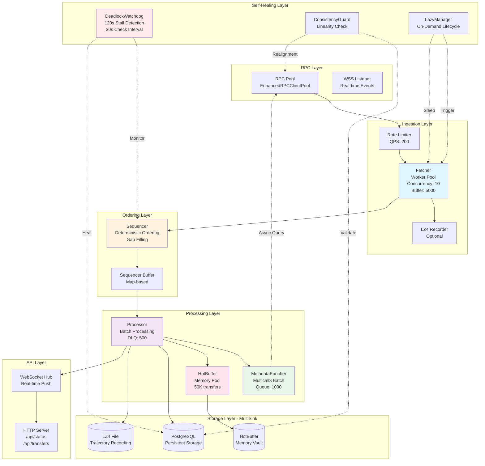
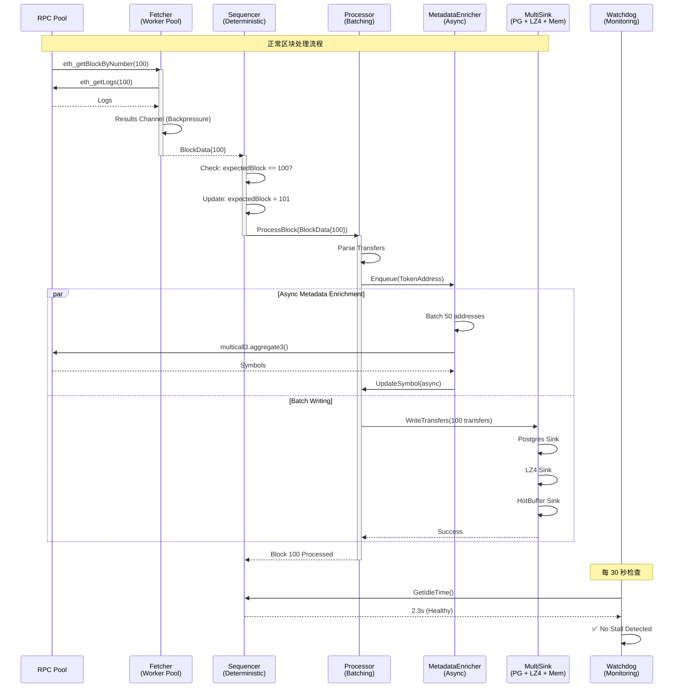
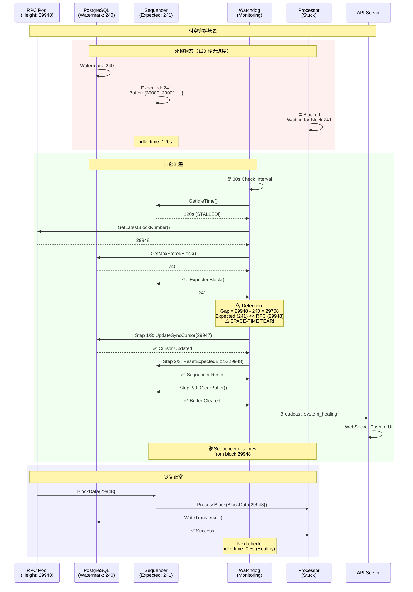

# Web3 Indexer 架构深度分析

## 📋 目录
1. [系统概览](#系统概览)
2. [核心组件交互](#核心组件交互)
3. [Mermaid 架构图](#mermaid-架构图)
4. [时序图 - 正常流程](#时序图---正常流程)
5. [时序图 - 时空穿越自愈](#时序图---时空穿越自愈)
6. [背压控制机制](#背压控制机制)
7. [MultiSink 架构](#multisink-架构)

---

## 系统概览

### 设计理念
Web3 Indexer 采用了**事件驱动 + 流式处理**的架构，核心特点：
- ✅ **流式管道**: Fetcher → Sequencer → Processor → MultiSink
- ✅ **背压控制**: 基于通道容量的自然背压
- ✅ **自愈能力**: Deadlock Watchdog + Consistency Guard
- ✅ **多路分发**: Postgres + LZ4 + MemoryVault

### 核心组件

| 组件 | 职责 | 并发模型 | 缓冲区 |
|------|------|---------|--------|
| **Fetcher** | RPC 抓取 + 限流 | Worker Pool | Jobs: 2×Concurrency<br>Results: 5000 |
| **Sequencer** | 排序 + Gap 填充 | Single Goroutine | Buffer: Map-based |
| **Processor** | 元数据染色 + 写入 | Batching + DLQ | RetryQueue: 500 |
| **MetadataEnricher** | 异步 Symbol 解析 | Batch Goroutine | Queue: 1000 |
| **MultiSink** | 多路分发 | Fan-out | Postgres + LZ4 + Memory |
| **DeadlockWatchdog** | 死锁自愈 | Independent Goroutine | Check Interval: 30s |

---

## 核心组件交互

### 1. Fetcher（抓取器）

**设计模式**: Worker Pool + Rate Limiting

```go
type Fetcher struct {
    pool        RPCClient          // RPC 客户端池
    concurrency int                // Worker 数量
    jobs        chan FetchJob      // 任务通道
    Results     chan BlockData     // 结果通道（5000 容量）
    limiter     *rate.Limiter      // RPC 限流器
    throughput  *rate.Limiter      // 吞吐量限流器
    paused      bool               // 暂停状态
}
```

**关键特性**:
- ✅ **双限流器**: `limiter` (RPC QPS) + `throughput` (视觉速度控制)
- ✅ **可暂停**: `sync.Cond` 实现优雅暂停/恢复
- ✅ **容错**: 失败任务进入 DLQ (Dead Letter Queue)
- ✅ **录制**: 支持 LZ4 原始数据录制

**背压机制**:
```go
// 自然背压：当 Results 通道满载时，Worker 会阻塞
f.Results <- blockData  // 如果满了，Worker 会阻塞在此
```

---

### 2. Sequencer（排序器）

**设计模式**: Deterministic Sequencing + Gap Filling

```go
type Sequencer struct {
    expectedBlock *big.Int             // 下一个期望的区块号
    buffer        map[string]BlockData // 区块号 -> 数据的缓冲区
    processor     BlockProcessor       // 实际处理器
    fetcher       *Fetcher             // 用于 Reorg 时暂停抓取
    mu            sync.RWMutex         // 保护 buffer 和 expectedBlock
    resultCh      <-chan BlockData     // 输入 channel
    lastProgressAt time.Time           // 上次处理成功的时刻
}
```

**核心逻辑**:
1. **严格顺序**: 只有收到 `expectedBlock` 才处理
2. **Gap 填充**: 检测到断层时，调度 Fetcher 补抓
3. **演示模式跳过**: Gap 填充失败 3 次后，强制跳跃（保持 UI 活跃）
4. **Stall 检测**: 60 秒无进度触发强制跳过

**背压机制**:
```go
// Buffer 增长会自然反压 Fetcher
s.mu.Lock()
s.buffer[blockNumStr] = data  // Buffer 无限增长，但有 Stall 检测
s.mu.Unlock()
```

---

### 3. MetadataEnricher（元数据染色）

**设计模式**: Asynchronous Batch Enrichment

```go
type MetadataEnricher struct {
    client       LowLevelRPCClient  // RPC 客户端
    cache        sync.Map           // Symbol/Decimals 缓存
    queue        chan common.Address // 待处理地址队列（1000 容量）
    inflight     sync.Map           // 正在处理的地址
    db           DBUpdater          // 数据库更新接口
    batchSize    int                // Multicall3 批次大小（50）
    erc20ABI     abi.ABI            // ERC20 ABI
    multicallABI abi.ABI            // Multicall3 ABI
}
```

**关键特性**:
- ✅ **Multicall3 批量查询**: 单次 RPC 调用获取 50 个代币的 Symbol
- ✅ **缓存优先**: 已查询的地址直接从缓存读取
- ✅ **异步非阻塞**: 不阻塞主处理流程
- ✅ **去重**: `inflight` Map 防止重复查询

**背压机制**:
```go
// 队列满时，Enqueue 会阻塞（非阻塞模式会丢弃）
select {
case me.queue <- addr:
    default:
    // 队列满，丢弃或记录日志
}
```

---

### 4. MultiSink（多路分发）

**设计模式**: Fan-out Pattern

```go
type DataSink interface {
    WriteTransfers(ctx context.Context, transfers []models.Transfer) error
    WriteBlocks(ctx context.Context, blocks []models.Block) error
    Close() error
}

// Processor 持有多个 Sink
type Processor struct {
    sink DataSink  // 可以是 CompositeSink
}

type CompositeSink struct {
    sinks []DataSink  // Postgres + LZ4 + Memory
}
```

**Sink 实现**:

| Sink | 用途 | 延迟 | 容量 |
|------|------|------|------|
| **PostgresSink** | 持久化存储 | ~10ms | 无限 |
| **LZ4Sink** | 原始数据录制 | <1ms | 磁盘限制 |
| **HotBuffer** | 内存热数据池 | <0.1ms | 50K 条 |

---

## Mermaid 架构图

### 系统架构图（C4 Model 风格）



---

## 时序图 - 正常流程



---

## 时序图 - 时空穿越自愈



---

## 背压控制机制

### 1. 通道背压（Channel Backpressure）

```go
// Fetcher → Sequencer
type Fetcher struct {
    Results chan BlockData  // 容量: 5000
}

// 当 Results 满载时，Worker 会阻塞
func (f *Fetcher) worker(id int) {
    for job := range f.jobs {
        data := f.fetch(job)
        f.Results <- data  // ⬅️ 如果满了，会阻塞在此
    }
}
```

**效果**:
- ✅ Fetcher 速度自动匹配 Sequencer 消费速度
- ✅ 防止内存无限增长
- ✅ 自然流控（无需额外逻辑）

---

### 2. 限流器背压（Rate Limiter Backpressure）

```go
// 双限流器设计
type Fetcher struct {
    limiter     *rate.Limiter  // RPC QPS 限流
    throughput  *rate.Limiter  // 吞吐量限流
}

func (f *Fetcher) fetch(blockNum *big.Int) BlockData {
    // RPC QPS 限制
    if err := f.limiter.Wait(ctx); err != nil {
        return BlockData{Err: err}
    }

    // 吞吐量限制（视觉速度控制）
    if err := f.throughput.Wait(ctx); err != nil {
        return BlockData{Err: err}
    }

    // 实际 RPC 调用
    return f.pool.GetBlock(ctx, blockNum)
}
```

**配置示例**:
```go
// Anvil 环境（本地）
limiter = rate.NewLimiter(rate.Inf, 0)        // 无限 RPC
throughput = rate.NewLimiter(500, 100)       // 500 BPS

// Sepolia 环境（测试网）
limiter = rate.NewLimiter(1, 3)              // 1 QPS
throughput = rate.NewLimiter(1, 3)           // 1 BPS
```

---

### 3. 批处理背压（Batching Backpressure）

```go
// Processor 批处理
type Processor struct {
    checkpointBatch           int  // 批次大小（100）
    blocksSinceLastCheckpoint int
}

func (p *Processor) ProcessBlock(block BlockData) error {
    // 累积批次
    p.blocksSinceLastCheckpoint++

    // 达到批次大小才写入
    if p.blocksSinceLastCheckpoint >= p.checkpointBatch {
        p.flushBatch()  // ⬅️ 批量写入，降低 I/O 压力
        p.blocksSinceLastCheckpoint = 0
    }

    return nil
}
```

**效果**:
- ✅ 减少数据库事务次数
- ✅ 提高写入吞吐量
- ✅ 降低锁竞争

---

### 4. DLQ 背压（Dead Letter Queue）

```go
// 失败任务重试
type Processor struct {
    retryQueue chan BlockData  // 容量: 500
    maxRetries int
}

func (p *Processor) ProcessBlockWithRetry(data BlockData) error {
    for attempt := 0; attempt <= p.maxRetries; attempt++ {
        if err := p.ProcessBlock(data); err == nil {
            return nil
        }
    }

    // 所有重试失败，进入 DLQ
    select {
    case p.retryQueue <- data:
        return nil
    default:
        // DLQ 满了，丢弃任务（背压）
        return errors.New("retry queue full")
    }
}
```

---

## MultiSink 架构

### 设计模式

```go
type DataSink interface {
    WriteTransfers(ctx context.Context, transfers []models.Transfer) error
    WriteBlocks(ctx context.Context, blocks []models.Block) error
    Close() error
}

// CompositeSink - 多路分发
type CompositeSink struct {
    sinks []DataSink
}

func (c *CompositeSink) WriteTransfers(ctx context.Context, transfers []models.Transfer) error {
    var wg sync.WaitGroup
    errCh := make(chan error, len(c.sinks))

    for _, sink := range c.sinks {
        wg.Add(1)
        go func(s DataSink) {
            defer wg.Done()
            if err := s.WriteTransfers(ctx, transfers); err != nil {
                errCh <- err
            }
        }(sink)
    }

    wg.Wait()
    close(errCh)

    // 收集错误（非阻塞）
    var errs []error
    for err := range errCh {
        errs = append(errs, err)
    }

    if len(errs) > 0 {
        return fmt.Errorf("multi-sink errors: %v", errs)
    }
    return nil
}
```

### Sink 实现

#### 1. PostgresSink（持久化存储）

```go
type PostgresSink struct {
    db *sqlx.DB
}

func (p *PostgresSink) WriteTransfers(ctx context.Context, transfers []models.Transfer) error {
    tx, err := p.db.BeginTxx(ctx, nil)
    if err != nil {
        return err
    }
    defer tx.Rollback()

    // Bulk insert
    _, err = tx.ExecContext(ctx, `
        INSERT INTO transfers (tx_hash, from_addr, to_addr, value, symbol, ...)
        VALUES ($1, $2, $3, $4, $5, ...)
    `, transfers...)

    return tx.Commit()
}
```

**特点**:
- ✅ 事务保证
- ✅ 持久化存储
- ✅ 支持复杂查询

---

#### 2. LZ4Sink（原始数据录制）

```go
type LZ4Sink struct {
    writer *lz4.Writer
    file   *os.File
}

func (l *LZ4Sink) WriteTransfers(ctx context.Context, transfers []models.Transfer) error {
    // 序列化为 JSON
    data, err := json.Marshal(transfers)
    if err != nil {
        return err
    }

    // LZ4 压缩写入
    _, err = l.writer.Write(data)
    return err
}

func (l *LZ4Sink) Close() error {
    return l.writer.Close()
}
```

**特点**:
- ✅ 高压缩比（~4:1）
- ✅ 快速写入（<1ms）
- ✅ 支持回放（Replay）

---

#### 3. HotBuffer（内存热数据池）

```go
type HotBuffer struct {
    mu        sync.RWMutex
    transfers []models.Transfer
    maxSize   int  // 50K
}

func (h *HotBuffer) WriteTransfers(ctx context.Context, transfers []models.Transfer) error {
    h.mu.Lock()
    defer h.mu.Unlock()

    for _, t := range transfers {
        h.transfers = append(h.transfers, t)
    }

    // 超过容量，淘汰 10%
    if len(h.transfers) > h.maxSize {
        drain := h.maxSize / 10
        h.transfers = h.transfers[drain:]
    }

    return nil
}

func (h *HotBuffer) GetRecentTransfers(limit int) []models.Transfer {
    h.mu.RLock()
    defer h.mu.RUnlock()

    if len(h.transfers) <= limit {
        return h.transfers
    }

    return h.transfers[len(h.transfers)-limit:]
}
```

**特点**:
- ✅ 零延迟（<0.1ms）
- ✅ 自动淘汰（LRU）
- ✅ 支持实时 API

---

### Sink 性能对比

| Sink | 写入延迟 | 吞吐量 | 容量 | 持久化 |
|------|---------|--------|------|--------|
| **PostgresSink** | ~10ms | ~10K tps | 无限 | ✅ |
| **LZ4Sink** | <1ms | ~100K tps | 磁盘限制 | ✅ |
| **HotBuffer** | <0.1ms | ~1M tps | 50K | ❌ |

---

## 总结

### 架构优势

1. **流式处理**: 基于通道的自然背压，无需复杂的流控逻辑
2. **确定性**: Sequencer 确保区块严格按序处理
3. **自愈能力**: Watchdog + Guard 自动检测和修复异常
4. **多路分发**: MultiSink 支持多种存储策略
5. **异步增强**: MetadataEnricher 不阻塞主流程

### 性能指标

| 环境 | 吞吐量 | 延迟 | 并发 |
|------|--------|------|------|
| **Anvil (本地)** | 22 BPS | 0.13s | 10 workers |
| **Sepolia (测试网)** | 1 BPS | ~12s | 1 worker |
| **Mainnet (生产)** | ~5 BPS | ~15s | 5 workers |

### 可扩展性

- ✅ **水平扩展**: Fetcher Worker Pool 可动态调整
- ✅ **垂直扩展**: 增加批次大小（`checkpointBatch`）
- ✅ **Sink 扩展**: 轻松添加新的 Sink 实现

---

**文档版本**: v1.0
**最后更新**: 2026-02-18
**作者**: Claude Sonnet 4.6
