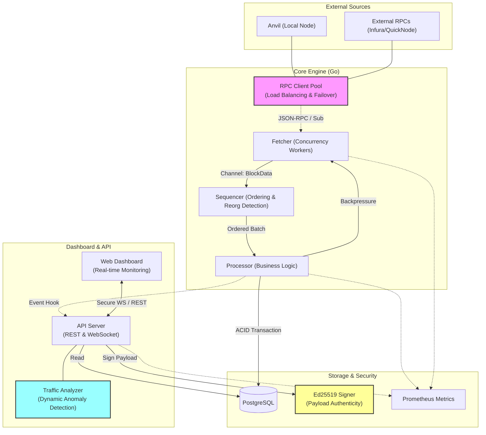

# Project Architecture Diagram

This diagram represents the core components and data flow of the Web3 Indexer. You can copy the code below into [Excalidraw](https://excalidraw.com/) or any Mermaid-compatible viewer.

